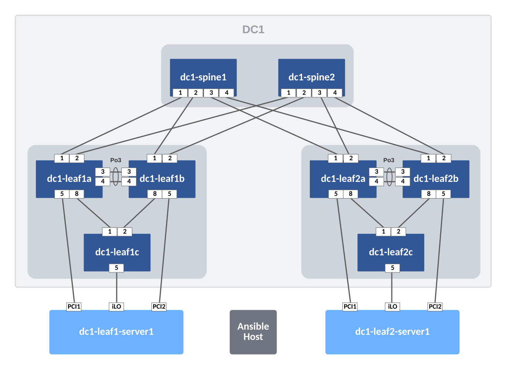
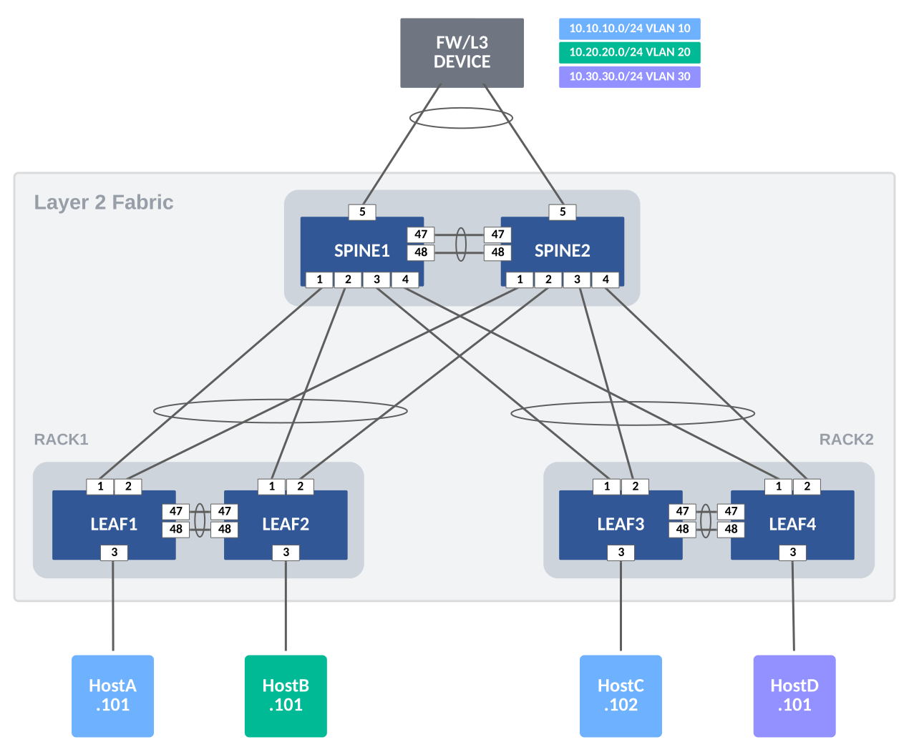

# Topology Examples

## Single DC L3LS



&emsp;

&emsp;
👉 Save the following yml in topology.yml or your custom topology yml file - You can replace the names, change the management network and subnet pool

```yaml
management_network: a-135
subnet_pool: 172.16.0.0/16

connections:
  # Spine1 to Leaf1A/1B/2A/2B
  - { device1: SPINE1, intf1: Ethernet1/1,  device2: LEAF1A, intf2: Ethernet1 }
  - { device1: SPINE1, intf1: Ethernet1/2,  device2: LEAF1B, intf2: Ethernet1 }
  - { device1: SPINE1, intf1: Ethernet1/3,  device2: LEAF2A, intf2: Ethernet1 }
  - { device1: SPINE1, intf1: Ethernet1/4,  device2: LEAF2B, intf2: Ethernet1 }

  # Spine2 to Leaf1A/1B/2A/2B
  - { device1: SPINE2, intf1: Ethernet1/1,  device2: LEAF1A, intf2: Ethernet2 }
  - { device1: SPINE2, intf1: Ethernet1/2,  device2: LEAF1B, intf2: Ethernet2 }
  - { device1: SPINE2, intf1: Ethernet1/3,  device2: LEAF2A, intf2: Ethernet2 }
  - { device1: SPINE2, intf1: Ethernet1/4,  device2: LEAF2B, intf2: Ethernet2 }

  # MLAG/peer-links between LEAF1A/1B
  - { device1: LEAF1A, intf1: Ethernet3, device2: LEAF1B, intf2: Ethernet3 }
  - { device1: LEAF1A, intf1: Ethernet4, device2: LEAF1B, intf2: Ethernet4 }

  # MLAG/peer-links between LEAF2A/2B
  - { device1: LEAF2A, intf1: Ethernet3, device2: LEAF2B, intf2: Ethernet3 }
  - { device1: LEAF2A, intf1: Ethernet4, device2: LEAF2B, intf2: Ethernet4 }

  # Leaf Group-1 to Leaf1C
  - { device1: LEAF1A, intf1: Ethernet8, device2: LEAF1C, intf2: Ethernet1 }
  - { device1: LEAF1B, intf1: Ethernet8, device2: LEAF1C, intf2: Ethernet2 }

  # Leaf Group-2 to Leaf2C
  - { device1: LEAF2A, intf1: Ethernet8, device2: LEAF2C, intf2: Ethernet1 }
  - { device1: LEAF2B, intf1: Ethernet8, device2: LEAF2C, intf2: Ethernet2 }

  # Leaf-Server1 Connections
  - { device1: LEAF1-SERVER1, intf1: Ethernet1, device2: LEAF1A, intf2: Ethernet5 } #PCI1
  - { device1: LEAF1-SERVER1, intf1: Ethernet2, device2: LEAF1C, intf2: Ethernet5 } #iLO
  - { device1: LEAF1-SERVER1, intf1: Ethernet3, device2: LEAF1B, intf2: Ethernet5 } #PCI2

  # Leaf-Server1 Connections
  - { device1: LEAF2-SERVER1, intf1: Ethernet1, device2: LEAF2A, intf2: Ethernet5 } #PCI1
  - { device1: LEAF2-SERVER1, intf1: Ethernet2, device2: LEAF2C, intf2: Ethernet5 } #iLo
  - { device1: LEAF2-SERVER1, intf1: Ethernet3, device2: LEAF2B, intf2: Ethernet5 } #PCI2
```

&emsp;

&emsp;

## L2LS Fabric



&emsp;

&emsp;
👉 Save the following yml in topology.yml or your custom topology yml file - You can replace the names, change the management network and subnet pool

```yaml
management_network: a-135
subnet_pool: 172.16.0.0/16

connections:

  # FW to Spine1/Spine2
  - { device1: FW, intf1: Ethernet1,  device2: SPINE1, intf2: Ethernet5 }
  - { device1: FW, intf1: Ethernet2,  device2: SPINE2, intf2: Ethernet5 }

  # Spine1 to Leaf1/2/3/4
  - { device1: SPINE1, intf1: Ethernet1/1,  device2: LEAF1, intf2: Ethernet1 }
  - { device1: SPINE1, intf1: Ethernet1/2,  device2: LEAF2, intf2: Ethernet1 }
  - { device1: SPINE1, intf1: Ethernet1/3,  device2: LEAF3, intf2: Ethernet1 }
  - { device1: SPINE1, intf1: Ethernet1/4,  device2: LEAF4, intf2: Ethernet1 }

  # Spine2 to Leaf1/2/3/4
  - { device1: SPINE2, intf1: Ethernet1/1,  device2: LEAF1, intf2: Ethernet2 }
  - { device1: SPINE2, intf1: Ethernet1/2,  device2: LEAF2, intf2: Ethernet2 }
  - { device1: SPINE2, intf1: Ethernet1/3,  device2: LEAF3, intf2: Ethernet2 }
  - { device1: SPINE2, intf1: Ethernet1/4,  device2: LEAF4, intf2: Ethernet2 }

  # MLAG/peer-links between SPINE1/SPINE2
  - { device1: SPINE1, intf1: Ethernet1/47, device2: SPINE2, intf2: Ethernet1/47 }
  - { device1: SPINE1, intf1: Ethernet1/48, device2: SPINE2, intf2: Ethernet1/48 }

  # MLAG/peer-links between LEAF1/LEAF2
  - { device1: LEAF1, intf1: Ethernet47, device2: LEAF2, intf2: Ethernet47 }
  - { device1: LEAF1, intf1: Ethernet48, device2: LEAF2, intf2: Ethernet48 }

  # MLAG/peer-links between LEAF3/4
  - { device1: LEAF3, intf1: Ethernet47, device2: LEAF4, intf2: Ethernet47 }
  - { device1: LEAF3, intf1: Ethernet48, device2: LEAF4, intf2: Ethernet48 }

  # Host Connections
  - { device1: HostA, intf1: Ethernet1, device2: LEAF1, intf2: Ethernet3 }
  - { device1: HostB, intf1: Ethernet2, device2: LEAF2, intf2: Ethernet3 }
  - { device1: HostC, intf1: Ethernet3, device2: LEAF3, intf2: Ethernet3 }
  - { device1: HostD, intf1: Ethernet3, device2: LEAF4, intf2: Ethernet3 }
```
